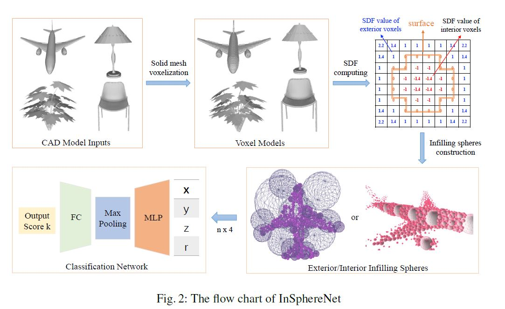
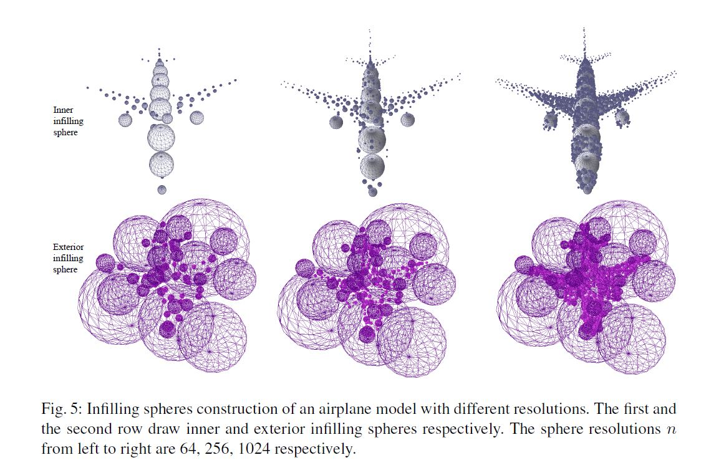
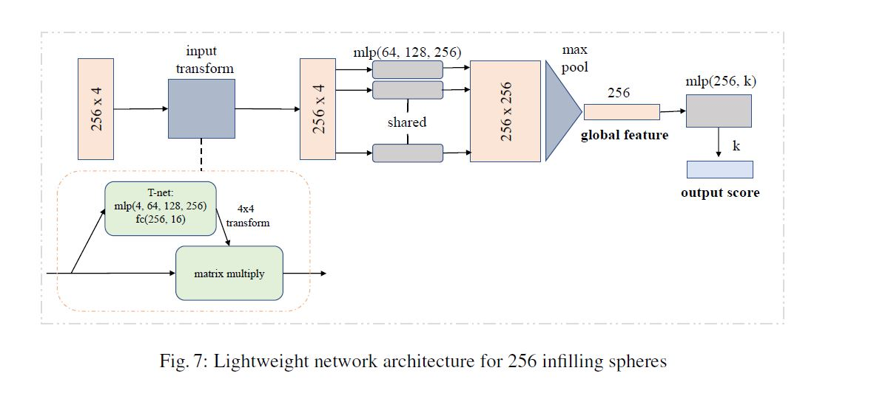
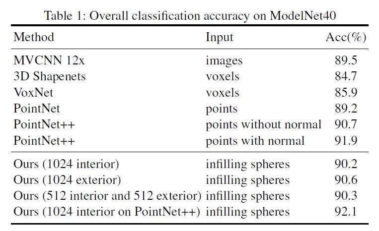
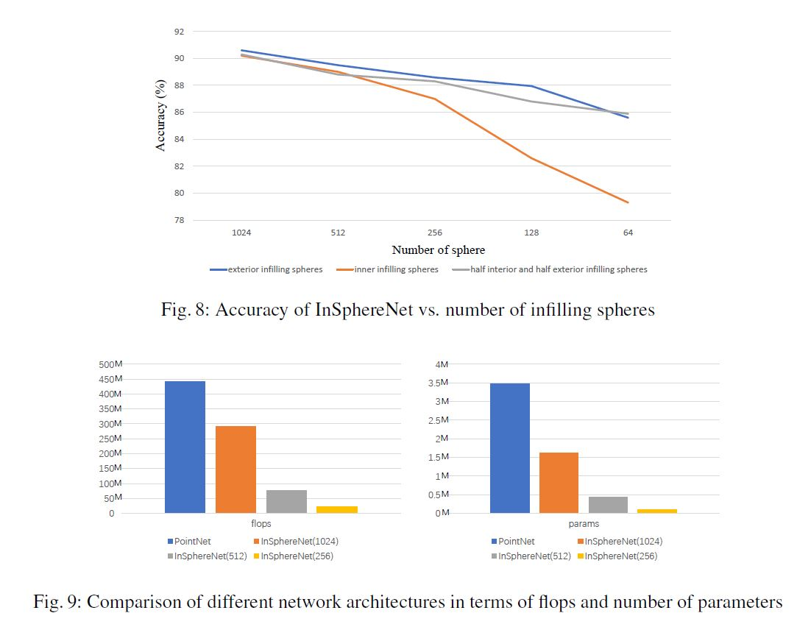

# InSphereNet: a Concise Representation andClassification Method for 3D Object

## Abstract
In this paper, we present an InSphereNet method for the problem of 3D object classification. Unlike previous methods that use points, voxels, or multi-view images as inputs of deep neural network (DNN), the proposed method constructs a class of more representative features named infilling spheres from signed distance field (SDF). Because of the admirable spatial representation of infilling spheres, we can not only utilize very fewer number of spheres to accomplish classification task, but also design a lightweight InSphereNet with less layers and parameters than previous methods. Experiments on ModelNet40 show that the proposed method leads to superior performance than PointNet in accuracy. In particular, if there are only a few dozen sphere inputs or about 100000 DNN parameters, the accuracy of our method remains at a very high level. 
## Our Approach
Firstly, we voxelize the 3Dmodel with a high resolution of 512 x 512 x 512. Secondly, the SDF value of each voxel within an external sphere is computed. Thirdly, a number of voxels with larger SDF values are selected according to three criteria. Finally, positions and radii of selected infilling spheres are fed into the classification network. The detailed workflow is illustrated in Fig. 2. 

## Infilling Sphere Construction
Instead of using point cloud to represent a 3D model, our key idea is to fill the inside or outside of the 3D model with an appropriate number of infilling spheres. Here a sphere is defined by a voxel with the voxel coordinate as its center and the SDF value as its radius. Thus it is suitable to represent the spatial occupation of an object. 

## lightweight network
When the infilling spheres are constructed, we can directly input these 4D primitives (coordinates of the sphere center plus the radius) into PointNet with a little adjustment to accomplish object classification. However, since a few number of spheres are necessary for complete representation of a 3D object, we empirically propose a lightweight network architecture, leading to faster training and inference. The lightweight network architecture with the proposed infilling spheres as inputs are named InSphereNet. As demonstrated in experiments, InSphereNet can perform as well as PointNet even with only 12% parameters and 17% FLOPS. Fig. 7 shows the designed lightweight network architecture for 256 infilling spheres. It is worth noting that there are only about 100000 parameters in this classification network. 

## experiment

